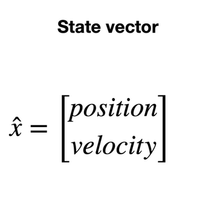
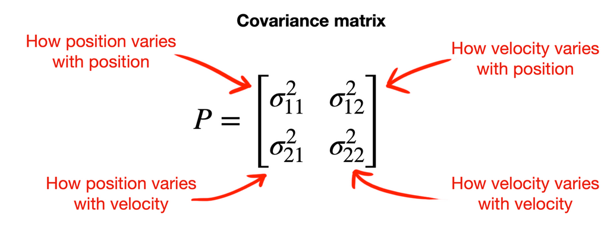

# Kalman Filter


Filtre de kalman pour un plan 3D traitant des données issues d'un capteur IMU embarquant:
- un accéléromètre
- un gyroscope
- un GPS

Les mesures subissent un bruit blanc gaussien tel que:
$$Accelerometer: \mu = 0 , \sigma = 10^{-3}$$
$$Gyroscope: \mu = 0 , \sigma = 10^{-2}$$
$$GPS: \mu = 0 , \sigma = 10^{-1}$$

## Initialization

On appelle **état du système** le vecteur qui contient les variables d'intérêt que l'on souhaite estimer. 

Dans notre cas, nous allons estimer la **position** et la **vélocité** du système dans les trois dimensions de l'espace, soit un vecteur d'état de la forme: <br>
$x = [x, y, z, v_x, v_y, v_z]^T$. <br>


### Connaissance a priori
Le filtre de Kalman se base  sur une forte connaissance a priori du syteme. Nécessitant d'une initialisation minutieuse:
- $F$: la matrice de transition d'état, qui décrit comment l'état du système évolue dans un intervalle de temps $\Delta t$.: <br>
``` math
F = \begin{bmatrix}
1.0 & 0.0 & 0.0 & \Delta t & 0.0 & 0.0 \\\
0.0 & 1.0 & 0.0 & 0.0 & \Delta t & 0.0 \\\
0.0 & 0.0 & 1.0 & 0.0 & 0.0 & \Delta t \\\
0.0 & 0.0 & 0.0 & 1.0 & 0.0 & 0.0 \\\
0.0 & 0.0 & 0.0 & 0.0 & 1.0 & 0.0 \\\
0.0 & 0.0 & 0.0 & 0.0 & 0.0 & 1.0
\end{bmatrix}
```
avec: $\Delta t = 0.01$


- $H$: Matrice d'observation. Relie les observations aux états du système. Dans notre cas on observe uniquement les positions:
``` math
H = \begin{bmatrix}
1.0 & 0.0 & 0.0 & 0.0 & 0.0 & 0.0 \\
0.0 & 1.0 & 0.0 & 0.0 & 0.0 & 0.0 \\
0.0 & 0.0 & 1.0 & 0.0 & 0.0 & 0.0
\end{bmatrix}
```

- $Q$: Matrice de covariance représentant l'incertitude du modèle de transition d'état. Donc $Q$ représente la covariance du bruit a priori (que le filtre suppose exister) dans la prédiction.

- $R$: la matrice de covariance des mesures issue de l'IMU.
Définit par les specifications du capteur.
``` math
R = \begin{bmatrix}
\sigma_{gps}^2 & 0 & 0 \\
0 & \sigma_{gps}^2 & 0 \\
0 & 0 & \sigma_{gps}^2
\end{bmatrix}
```
Où: $\sigma_{gps}^2 = 10^{-2}$


- $P$: Incertitude initiale sur l'estimation de l'état du système.
``` math
P = \begin{bmatrix}
\sigma_{pos}^2 & 0 & 0 & 0 & 0 & 0 \\
0 & \sigma_{pos}^2 & 0 & 0 & 0 & 0 \\
0 & 0 & \sigma_{pos}^2 & 0 & 0 & 0 \\
0 & 0 & 0 & \sigma_{vel}^2 & 0 & 0 \\
0 & 0 & 0 & 0 & \sigma_{vel}^2 & 0 \\
0 & 0 & 0 & 0 & 0 & \sigma_{vel}^2
\end{bmatrix} * \lambda
```
Où: $\sigma_{vel}^2 = \sigma_{gyro}^2 + \sigma_{acc}^2 * (\Delta t)^2$ variance de la vélocité et $\lambda$ = 10 facteur de confiance dans l'estimation initiale.



- $B$: la matrice de contrôle, qui relie les commandes aux états du système  (optionnelle).
``` math
B = \begin{bmatrix}
0.5 * (\Delta t)^2 & 0.0 & 0.0 \\
0.0 & 0.5 * (\Delta t)^2 & 0.0 \\
0.0 & 0.0 & 0.5 * (\Delta t)^2 \\
\Delta t & 0.0 & 0.0 \\
0.0 & \Delta t & 0.0 \\
0.0 & 0.0 & \Delta t
\end{bmatrix}
```

- $x$: Etat initial du système. <br>
Au lancement de l'IMU, le capteur nous envoie la position et la vitesse réelle.
``` math
x = \begin{bmatrix}
x_0 \\
y_0 \\
z_0 \\
v_{x0} \\
v_{y0} \\
v_{z0}
\end{bmatrix}
```

Ces paramètres sont essentiels au fonctionnement du filtre et doivent être choisis avec soin en fonction du système à modéliser.
Ainsi, il est nécessaire d'avoir une bonne compréhension du système et de ses caractéristiques pour pouvoir initialiser correctement le filtre de Kalman. <br>
D'une point de vue Bayesian, ce sont nos connaissances a priori.

## Prediction

1. Prédiction du prochain état à partir de l'état actuel et du contrôle d'entrée:
$$ x_{k|k-1} = F_k x_{k-1|k-1} + B u_k $$
Où:
- $x_{k|k-1}$: Estimation a priori de l'état du système à l'instant $k$ avant la mise à jour avec les mesures.
- $x_{k-1|k-1}$: Estimation a posteriori de l'état du système à l'instant $k-1$ après la mise à jour avec les mesures.
- $u_k$: Entrée de commande connue  a un instant $k$.  Influence l'évolution du système (optionnel)


2. Propagation de l'incertitude de l'estimation:
$$ P_{k|k-1} = F_k P_{k-1|k-1} F_k^T + Q $$

la forme $F_k P_{k-1|k-1} F_k^T$ permet de calculer la covariance de $P_{k|k-1}$ en prenant en compte la transformation linéaire $F_k$. 
Le terme $Q$ impacte directement la covariance de $P_{k|k-1}$ en ajoutant une incertitude supplémentaire à l'estimation de l'état du système.

## Update

1. Résidu de l'innovation
2. Covariance de l'innovation
3. Gain de Kalman optimal
4. Correction de l'estimation de l'état
5. Correction de la covariance de l'estimation

## Bibliography:
[https://medium.com/@sophiezhao_2990/kalman-filter-explained-simply-2b5672429205](https://medium.com/@sophiezhao_2990/kalman-filter-explained-simply-2b5672429205)

[engineeringmedia.com/controlblog/the-kalman-filter](https://engineeringmedia.com/controlblog/the-kalman-filter)